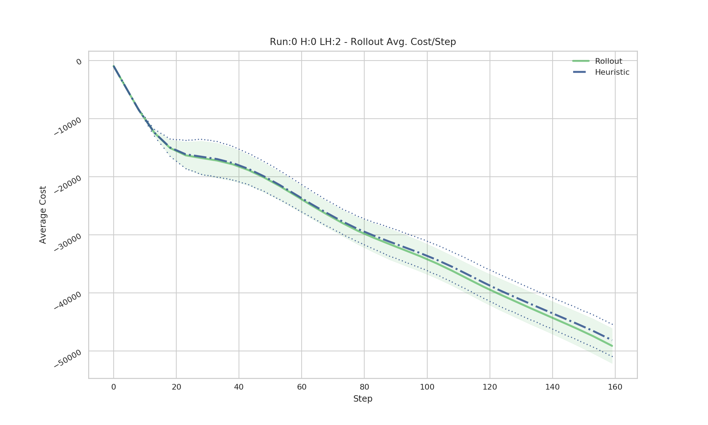
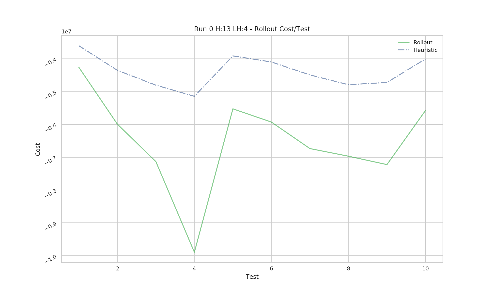

# Forest Fire Rollout implementation with GPU CUDA sampling
Fork from the ForestFire Environment:
	Forest Fire Environment Maker for OpenAI Gym. 
	*gym_forest_fire* 
	*version 2.4*

## Class Experiment
Using the class Experiment from the rollout.py makes easier and clean to set-up the test for the heuristics to run. In this version, you need two versions of the heuristic. One provided as a class or fuction, and another programmed on the rollout_sampler_gpu.py

### Experiment.make_gif()
Automatic gif archives generation from runs or tests.

### Each run generates automatic logs and graphs

## Draft
A butchered version to implement the rollout algorithm to generate a sub-optimal policy for an agent inside a Forest-Fire celular automata.

This version can sample the environment from the GPU ennabling large *lookahead trees* to sample in order of minutes; instead hours as with CPU.

This fork uses a modified version from the the gym environment to suit the project's needs. It's advise to run it as shown in the rollout_demo file.

