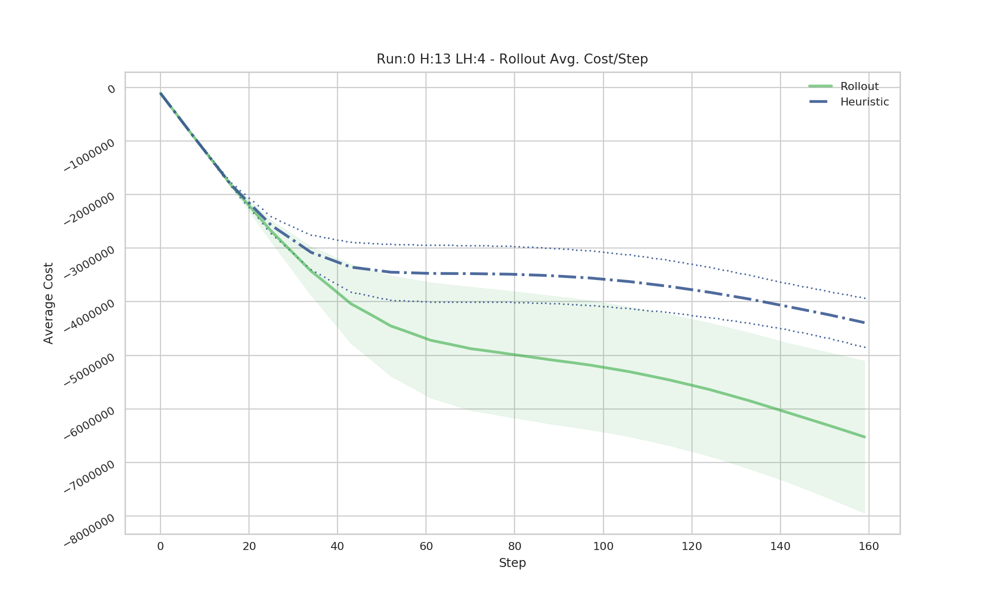

# Forest Fire Rollout implementation with GPU CUDA sampling
Fork from the ForestFire Environment:
	Forest Fire Environment Maker for OpenAI Gym. 
	*gym_forest_fire* 
	*version 2.4*

## Description
This project is an implementation of the rollout algorithm to generate a sub-optimal on-line policy for an agent inside a Forest-Fire celular automaton.

It has a sampler of the environment for the GPU CUDA capable for ennabling large *lookahead trees* to sample in order of minutes; instead hours as with CPU.

This fork uses a modified version from the the gym environment(https://github.com/elbecerrasoto/gym-forest-fire) to suit the project's needs. It's advise to run it as shown in the rollout_demo file.

## Class Experiment
Using the class Experiment from the rollout.py makes easier and clean to set-up the test for the heuristics to run. In this version, you need two versions of the heuristic. One provided as a class or fuction, and another programmed on the rollout_sampler_gpu.py

### Experiment.run()
One can run a test with the given paramenters. Eacch run has an unique start state from which it calculatess the averages  from applying the heuristic and the rollout agent to the environment

#### Each run generates automatic logs and graphs

#### Automatic gif archives generation from runs or tests passing GIF=True.

